# Installation journal
This is WIP!

## Retrive information
```
gh repo clone makerbase-mks/MKS-Monster8
```
I am using V2.0 of the board. 

### Poor documentation from MKS
Unfortunatelly the documentation is quite poor, especially for the V2.0.
MKS should look into the docs of BTT (SKR3) to learn how a good documentation should look like.

- There is nothing that deserves the name manual.
- Schematics of the board cannot be searched through, it is pure graphics.
- No values are written in the schematics.
- Wire labels are not alligned correctly in many places (E.g. Reset at pin 14 of the MCU). This is just dirty.

## Preparation of the board

### Flash firmware
1. Copy "MKS-Monster8/klipper firmware/mks_monster8 v0.10.0-557.bin" to µSd-Card (FAT) as "firmware.bin".
2. Set jumper USBPWR to ON (behind the USB-C connector).
3. Plug µSd-Card into board.
4. Connect board to host (Linux PC or RPI). Wait 1 second. (24V supply is not needed)

On host open a terminal:
```
ls -l /dev/serial/by-id
```
Response:
```
total 0
drwxr-xr-x 2 root root 80 Mai 17 11:24 ./
drwxr-xr-x 4 root root 80 Mai 17 09:25 ../
lrwxrwxrwx 1 root root 13 Mai 17 11:24 usb-Klipper_stm32f407xx_39003E001250304B56333920-if00 -> ../../ttyACM0
```

Use this part: "/dev/serial/by-id/usb-Klipper_stm32f407xx_39003E001250304B56333920-if00"
for the mcu section.

Note: This device name contains the serial number of the board and is therefore different on each installation. Using this method avoids the volatile naming (ttyACM0).

```
[mcu]
serial: /dev/serial/by-id/usb-Klipper_stm32f407xx_39003E001250304B56333920-if00
```

5. Unplug the board.
6. Set jumper USBPWR back to OFF !

Big Note: As you can find more below, my very first attempt to flash the firmware did fail and I still had the MARLIN FW installed.
A second attempt was successful. So please check the name of the device to see whether it really contains KLIPPER.

### Set Jumpers

1. In my case I use TMC 2209 in UART mode:

   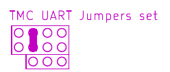 

2. Check the voltage for the fans. In my case I need 24V (VIN). These jumper are the factoy default.

   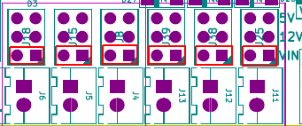

3. Check the jumper for end stop power. In my case I need 5V and this is the factory default.
	This is very important since I can probably fry the board?

   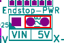

4. Check the voltage for the TMC drivers. 5V is recommended and factory default.

   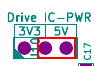

5. Check Jumpers for heatings. These must be unpluged, or the heating will be off.
   This is J14, J16, J17, J19.

   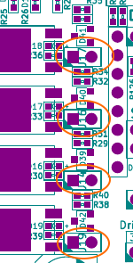


6. There are more jumpers, for now I leave them at factory defaults. Perhaps I will come back later and add more details.

## Wiring
### Check polarity of connections
For luck I did not find any differences for the pinouts of the connectors. + and - are correct.
Only the BL_Touch will need extra care due to different connectors.

### CR Touch
Creatlity uses a 5 pin connector, SKR 3 uses a 3 pin + a 2 pin connector and the Monster 8 uses a 3 pin (without plasic protection) and a JST XH 3 pin connector.
So I had to unlock the two pins from the 2 pin JST and place then correctly into a 3 pin JST.
### Prepare Klipper config

Using the correct version of the PIN file. In my case it is located in "MKS-Monster8/hardware/MKS Monster8 V2.0_002/MKS Monster8 V2.0_002 PIN.pdf". You can also find the schematics in the same directory.

There is an example Klipper config "MKS-Monster8/klipper firmware/generic-mks-monster8.cfg".
In my case I had a working config for the BTT SKR3 board, so I used that as a starting point and adjusted the pin definitions to the monster 8.

Both the example config (copy paste some lines) and the PIN definition file (PDF named above) do help with details. Below is a screenshot of the pin definitions to ensure you find the right file.

   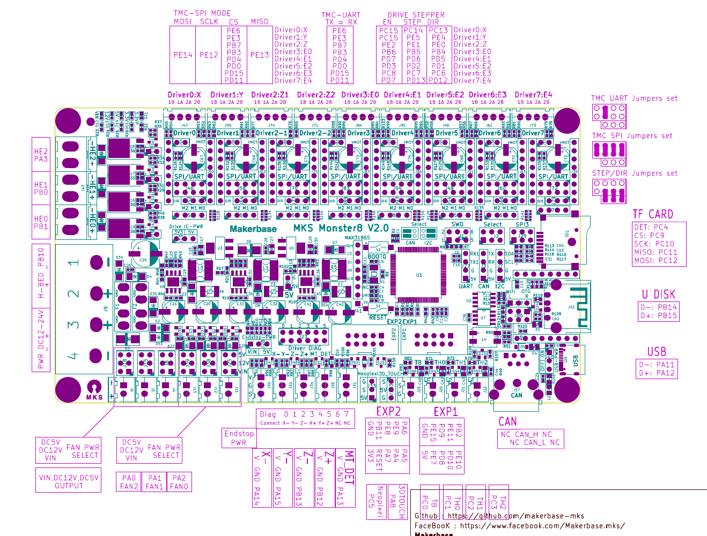

Klipper supports the split the config into several files. This help to find the right stuff later. Therefore my printer.cfg mostly contains include statements.

printer.cfg
```
[include mainsail.cfg]
[include sermoon_d1.cfg]
[include stepper.cfg]
[include extruder.cfg]
[include bed_screws.cfg]
[include bltouch.cfg]
[include z_tilt.cfg]
[include heater_bed.cfg]
[include fans.cfg]
[include mcu.cfg]
[include display.cfg]
[include filament_sensor.cfg]
[include leds.cfg]
[include input_shaper.cfg]
[include macros/macros.cfg]

# bltouch must be directly in printer.cfg in order the SAVE_CONFIG can work
[bltouch]
....

```

## Initial start up
Klipper does not find the MCU.

```
mcu 'mcu': Timeout on connect
mcu 'mcu': Wait for identify_response
Traceback (most recent call last):
  File "/home/pi/klipper/klippy/serialhdl.py", line 68, in _get_identify_data
    params = self.send_with_response(msg, 'identify_response')
  File "/home/pi/klipper/klippy/serialhdl.py", line 261, in send_with_response
    return src.get_response([cmd], self.default_cmd_queue)
  File "/home/pi/klipper/klippy/serialhdl.py", line 318, in get_response
    self.serial.raw_send_wait_ack(cmds[-1], minclock, reqclock,
  File "/home/pi/klipper/klippy/serialhdl.py", line 253, in raw_send_wait_ack
    self._error("Serial connection closed")
  File "/home/pi/klipper/klippy/serialhdl.py", line 61, in _error
    raise error(self.warn_prefix + (msg % params))
serialhdl.error: mcu 'mcu': Serial connection closed
```
Double checked the symlink and even tried /dev/ttyACM0.
Checked whether the modem manager is istalled and uninstalled it since it grabs the 
serial line for the first ~20 secs after a plug-in event (for CDC ACM devices). A udev rule can prevent the MM from touching the device, 
but removing it is easier for now.
```
sudo apt remove modemmanager
```
No success yet.

Well, it seams my initial attempt to write the klipper firmware did not work. After re-reading the symlink a few dozend times I saw it contained MARLIN. Sure it does not work.
```
/dev/serial/by-id/usb-STMicroelectronics_MARLIN_STM32F407VGT6_CCM_CDC_in_FS_Mode_2077338F4B30-if00
```
Did the firmware flash procedure again, and indeed the file was renamed to FIRMWARE.CUR. And the symlink now contains KLIPPER.
```
/dev/serial/by-id/usb-Klipper_stm32f407xx_39003E001250304B56333920-if00
```

Now Klipper connects to the MCU and I can proceed with further tests. I follow the guide there:
 https://www.klipper3d.org/Config_checks.html.

# Klipper Configuration checks
Though I do not use octoprint, this guide is very help full even with Mainsail.
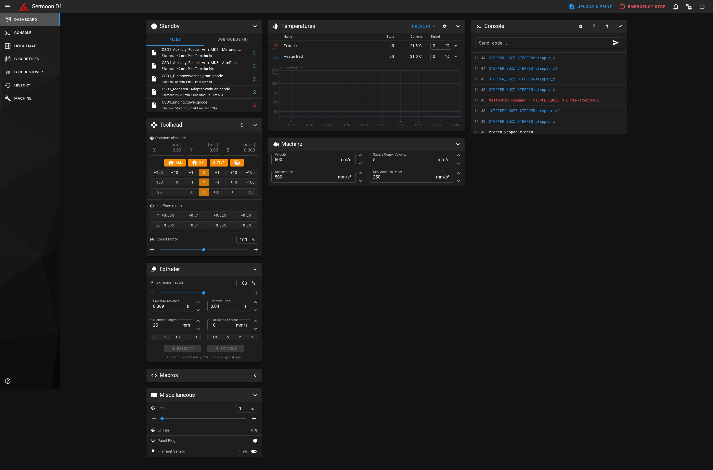

## Checking the heatings
In webinterface (Mainsail in my case), set set a bed temperature of 30°C, check whether temperature goes to 30°C and stays there.
Same with hot end. Check whether the fan in the hotend runs.
All passed in my case.

### PID Tuning for bed
This can take quite some time for a thick bed (mine is 9mm thick).
This command does start the PID tuning:
`PID_CALIBRATE HEATER=heater_bed TARGET=60`

Take the pid_xxx values from the response and add to the heater_bed section. Ensure you replace the '=' with ':'.
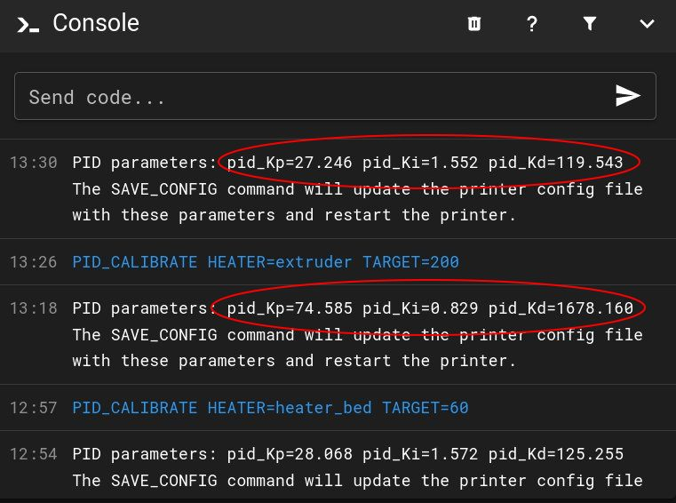

My heater_bed.cfg
```
[heater_bed]
heater_pin: PB10
sensor_type: EPCOS 100K B57560G104F
sensor_pin: PC0
control: pid
# after PID_CALIBRATE HEATER=heater_bed TARGET=60
pid_Kp:74.585
pid_Ki:0.829
pid_Kd:1678.160
min_temp: 0
max_temp: 100
```
### PID Tuning for hotend
This command does start the PID tuning:
`PID_CALIBRATE HEATER=extruder TARGET=200`

Klipper rises and lowers temperature to measure the parameters of the "controlled section" to
finally calculate the closed loop paramters (I assume per Ziegler-Nichols).

Take the pid_xxx values from the response and add to the extruder section. Ensure you replace the '=' with ':'.

My extruder.cfg
```
[extruder]
max_extrude_only_distance: 1000.0
step_pin: PB5
dir_pin: !PB4
enable_pin: !PB6
microsteps: 16
# after calibration
rotation_distance: 32.83
#rotation_distance: 33.500
nozzle_diameter: 0.400
filament_diameter: 1.750
heater_pin: PB1
sensor_type: EPCOS 100K B57560G104F
sensor_pin: PC1
control: pid
# after PID_CALIBRATE HEATER=extruder TARGET=200
pid_Kp:27.246
pid_Ki:1.552
pid_Kd:119.543
min_temp: 0
max_temp: 260

[tmc2209 extruder]
uart_pin: PB3
run_current: 0.600
diag_pin:
```

## Verify stepper motor enable pin
All motors can be moved easily. Well, except the extruder which I cannot test right now.

## Verify endstops
Since I use a CR Touch, there are only X and Y endstops. Let them check.
Command `QUERY_ENDSTOPS`  responds with
```
x:TRIGGERED y:TRIGGERED z:open
```
That is wrong, need to invert the inputs (remove the ! in front of the pin definition) and restart Klipper.
Now it is correct.
```
x:open y:open z:open
```
Now, do they actually trigger? Move both the X and Y axis to the zero point and reissue `QUERY_ENDSTOPS`.
```
x:TRIGGERED y:TRIGGERED z:open
```
Well done, endstops work.


## Steppers
Move back both X and Y to about the center. The `STEPPER_BUZZ` command moves an axis 10 times forth and back (1mm).
```
STEPPER_BUZZ STEPPER=stepper_x
STEPPER_BUZZ STEPPER=stepper_y
STEPPER_BUZZ STEPPER=stepper_z
STEPPER_BUZZ STEPPER=stepper_z1
```

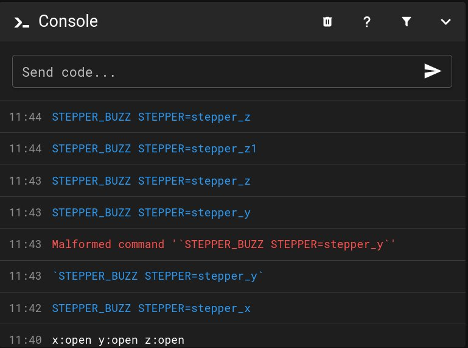

BTW: Cursor up brings the last command back, so it can be reissued or edited.

The test result showed that the X and Z axis are running backwards. Only Y and Z1 seems to be correct. And indeed, some of the dir_pin setting had no '!'. Only the correct ones had the '!'. Adding the '!' to all of the dir_pin setups and restart Klipper.

Now all axes but the Y look correct. Double check my old SKR 3 config. Even there the Y axis was different from the other axes. Most likley the wiring for the Y-Stepper is the root cause (it was not origial as I did buy the printer).

**In case you use my config as a starting point, check carefully here all the axes.**

In my case it looks good now.

## Homing test for X and Y
The dashboard offers buttons to start the homming for each of the axes.

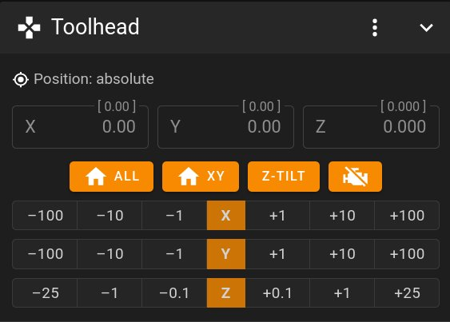

Both the X and Y do home properly. Now I need to check the CR Touch to be able to home the Z axis.

My stepper.cfg
```
# Note: X and Y do use the same enable pin.

[stepper_x]
step_pin: PC14
dir_pin: !PC13
enable_pin: !PC15
microsteps: 64
rotation_distance: 40
endstop_pin: PA14
position_min: -5
position_endstop: -5
position_max: 280
homing_speed: 50

[stepper_y]
step_pin: PE5
dir_pin: PE4
enable_pin: !PC15
microsteps: 64
rotation_distance: 40
endstop_pin: PA15
position_min: -5
position_endstop: -5
position_max: 260
homing_speed: 50

[stepper_z]
step_pin: PE1
dir_pin: PE0
enable_pin: !PE2
microsteps: 64
rotation_distance: 8
endstop_pin: probe:z_virtual_endstop
#endstop_pin: !PB13
#position_endstop: 0.5
position_max: 300
homing_speed: 4
second_homing_speed: 1
homing_retract_dist: 2.0
position_min: -1

# This is marked as E1 stepper driver on Monster 8
[stepper_z1]
step_pin: PD6
dir_pin: PD5
enable_pin: !PD7
microsteps: 64
rotation_distance: 8
endstop_pin: probe:z_virtual_endstop

########################################
# TMC2209 configuration
########################################

[tmc2209 stepper_x]
uart_pin: PE6
run_current: 0.800
diag_pin:
#stealthchop_threshold: 0
stealthchop_threshold: 999999

[tmc2209 stepper_y]
uart_pin: PE3
run_current: 0.800
diag_pin:
#stealthchop_threshold: 0
stealthchop_threshold: 999999

[tmc2209 stepper_z]
uart_pin: PB7
run_current: 0.8
diag_pin:
interpolate: False
#stealthchop_threshold: 0
stealthchop_threshold: 999999

[tmc2209 stepper_z1]
uart_pin: PD4
run_current: 0.8
diag_pin:
interpolate: False
#stealthchop_threshold: 0
stealthchop_threshold: 999999
```


### CR Touch
https://www.klipper3d.org/BLTouch.html

Pin down: `BLTOUCH_DEBUG COMMAND=pin_down` - works.

Pin up: `BLTOUCH_DEBUG COMMAND=pin_up` - works.

Does it trigger?
1. Again: `BLTOUCH_DEBUG COMMAND=pin_down`
2. `BLTOUCH_DEBUG COMMAND=touch_mode`
3. `QUERY_PROBE` - "probe: open"
4. Gently push it up
5. `QUERY_PROBE` - "probe: triggered"
6. `BLTOUCH_DEBUG COMMAND=pin_up`

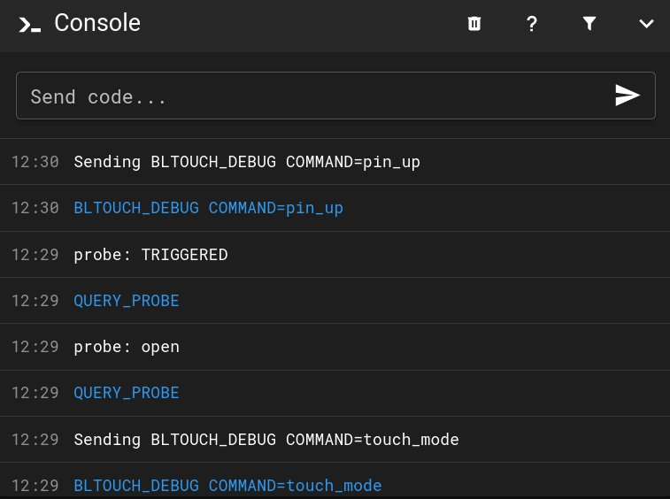

Ok, now lets home the Z axis. Watch carefully that both axes move correclty. **Know how to abort in error case.**

Works just fine here.

My bltouch.cfg
```
 Before printing the PROBE_CALIBRATE command needs to be issued
# to run the probe calibration procedure, described at
# docs/Probe_Calibrate.md, to find the correct z_offset.

[safe_z_home]                           # enable for BLTouch
home_xy_position: 93, 143
speed: 100
z_hop: 10
z_hop_speed: 5

# bltouch must be directly in printer.cfg in order the SAVE_CONFIG can work

[bed_mesh]                              # enable for BLTouch
speed: 100
mesh_min: 50, 5
mesh_max: 270, 250
algorithm: bicubic
probe_count: 10, 10
fade_start: 1
fade_end: 10
fade_target: 0
```
Since some portions need to be located directly in the printer.cfg:
```
# bltouch must be directly in printer.cfg in order the SAVE_CONFIG can work
[bltouch]
sensor_pin: ^PB13
control_pin: PA8
x_offset: 49
y_offset: -6
#z_offset: 1.656
speed: 3.0
```

### Z Tilt
Since I had z-tilt working already with ym SKR 3, I expect with works the same. Pressing the Z-Tilt button start it. Or enter Z-Tilt in the console.

Works just fine here.

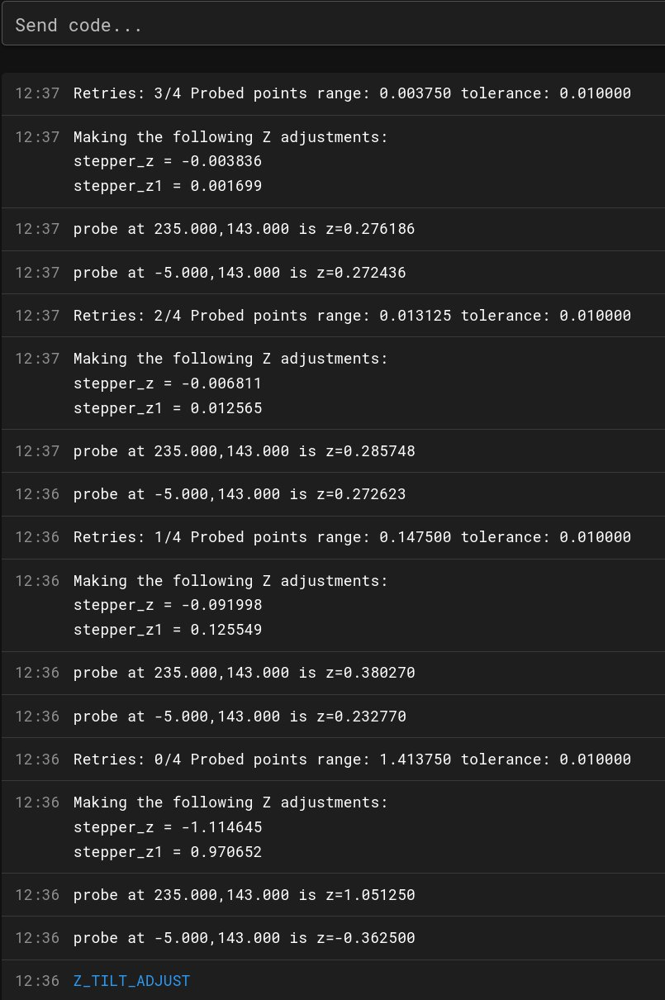

My Z-Tilt configuration might not fit to your printer, it depends on where the CR-Touch is mounted.

File z-tilt.cfg:
```
[z_tilt]
z_positions:
  -37,137
  317,137
#   A list of X, Y coordinates (one per line; subsequent lines
#   indented) describing the location of each bed "pivot point". The
#   "pivot point" is the point where the bed attaches to the given Z
#   stepper. It is described using nozzle coordinates (the X, Y position
#   of the nozzle if it could move directly above the point). The
#   first entry corresponds to stepper_z, the second to stepper_z1,
#   the third to stepper_z2, etc. This parameter must be provided.

points:
  -5,143
  235,143
#  197,143
#   A list of X, Y coordinates (one per line; subsequent lines
#   indented) that should be probed during a Z_TILT_ADJUST command.
#   Specify coordinates of the nozzle and be sure the probe is above
#   the bed at the given nozzle coordinates. This parameter must be
#   provided.

#speed: 50
#   The speed (in mm/s) of non-probing moves during the calibration.
#   The default is 50.
#horizontal_move_z: 5
#   The height (in mm) that the head should be commanded to move to
#   just prior to starting a probe operation. The default is 5.

retries: 4
#   Number of times to retry if the probed points aren't within
#   tolerance.

retry_tolerance: 0.01
#   If retries are enabled then retry if largest and smallest probed
#   points differ more than retry_tolerance. Note the smallest unit of
#   change here would be a single step. However if you are probing
#   more points than steppers then you will likely have a fixed
#   minimum value for the range of probed points which you can learn
#   by observing command output.
```

### Testing the filament runout sensor
On lower part of the dashboard there is the runout sensor. Check that the staus is correct in both cases.
If it shows "disabled", then click on it to enable.


filament_sensor.cfg
```
[filament_switch_sensor filament_sensor]
pause_on_runout: true
switch_pin: !PA13
```
### Extruder
Now that heatings are working and the other axes, the extruder is the last one to get tested.
1. Set temperatur to 205°C
2. wait until it is hot
3. With some filament inserted (was from last print), click "retract" in the dashboard.
   In my case it actually extruded. That means the direction is wrong and I had to 
   remove the '!' from the step_dir setting of the extruder. Restart Klipper to use the new settings.
   After such a change, start with 1.
   If retract and extrude work with the correct direction, you might want to calibrate the "steps".
   In my case this was already done earlier and a board swap should not change these values.

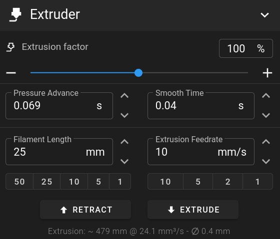

extruder.cfg as it now looks like.
```
[extruder]
max_extrude_only_distance: 1000.0
step_pin: PB5
dir_pin: PB4
enable_pin: !PB6
microsteps: 16
# after calibration
rotation_distance: 32.83
#rotation_distance: 33.500
nozzle_diameter: 0.400
filament_diameter: 1.750
heater_pin: PB1
sensor_type: EPCOS 100K B57560G104F
sensor_pin: PC1
control: pid
# after PID_CALIBRATE HEATER=extruder TARGET=200
pid_Kp:27.246
pid_Ki:1.552
pid_Kd:119.543
min_temp: 0
max_temp: 260
pressure_advance: 0.069

[tmc2209 extruder]
uart_pin: PB3
run_current: 0.600
diag_pin:
```

[See my setup of an auxilary feeder there](AuxilaryFeeder.md).


### LEDs
The LED strip just arrived 5 minutes ago, so I test it right away. It is a SK6812 RGBW strip and different from the 
one I used to test this with the SKR 3. https://de.aliexpress.com/item/4000907649687.html?spm=a2g0o.order_detail.order_detail_item.3.7e796368oC9bH5&gatewayAdapt=glo2deu

It has 5 wires connected to it. What are the two extra wires for? Ok, the two extra wires are for extra 5V and GND. For now I leave them unconnected.
The connector fits to the 3 pins of the Monster 8. - Working.

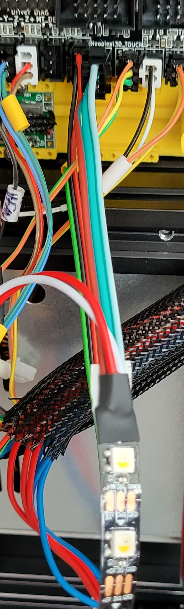

```
[neopixel panel_ring]
pin: PC5
#   The pin connected to the neopixel. This parameter must be
#   provided.
chain_count: 60
#   The number of Neopixel chips that are "daisy chained" to the
#   provided pin. The default is 1 (which indicates only a single
#   Neopixel is connected to the pin).
color_order: GRBW
#   Set the pixel order required by the LED hardware (using a string
#   containing the letters R, G, B, W with W optional). Alternatively,
#   this may be a comma separated list of pixel orders - one for each
#   LED in the chain. The default is GRB.
initial_RED: 1.0
initial_GREEN: 1.0
initial_BLUE: 1.0
initial_WHITE: 1.0
#   See the
```

To be continued....perhaps :-)

```

```
```
